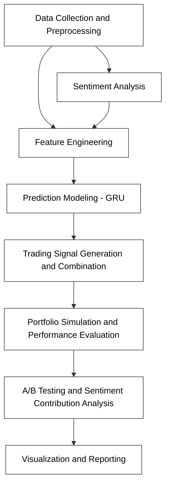

# README

**Crypto-Sentiment Trading System** is a modular python project that uses Reddit sentiment on r/CryptoCurrency together with technical indicators, macroeconomic and DeFi data to generate and backtest trading strategies on S&P 500 technology stocks.

## Overall Workflow

> Since we are frequently asked about the workflow behind our code implementation, we provide a simple diagram here for better understanding. :)




## Installation
1. Clone repository and enter:

```bash
git clone <repo-url>
cd crypto-sentiment-trading
```  
2. Create and activate a Python 3.8+ virtual environment:

```bash
python -m venv venv
source venv/bin/activate  # Windows: venv\Scripts\activate
```  
3. Install dependencies:

```bash
pip install -r requirements.txt
```  
4. Copy `fin580.env.example` to `fin580.env` and fill in your API keys (FRED, Reddit, FMP).

## Configuration (`fin580.env`)
```dotenv
START_DATE=2024-01-01
END_DATE=2024-12-31
REDDIT_SUBREDDIT=CryptoCurrency
OUTPUT_DIR=output

FRED_API_KEY=...
REDDIT_CLIENT_ID=...
REDDIT_CLIENT_SECRET=...
REDDIT_USER_AGENT=...
FMP_API_KEY=...
```

## Project Structure
```
├── main.py                  # System entry point
├── fin580.env.example       # Example environment file
├── requirements.txt         # Python dependencies

├── data_processor.py        # Loads and preprocesses price, macro, DeFi, Reddit data
├── sentiment_analyzer.py    # Computes post‑level and daily sentiment
├── analysis_strategy.py     # Generates technical, sentiment, and model signals
├── gru_model.py             # Defines and trains GRU for price prediction
├── portfolio_manager.py     # Backtests orders, computes metrics, generates reports and dashboards
├── tradingsystem.py         # Orchestrates end‑to‑end workflow

├── data/                    # Raw data (CSV samples & Reddit ZST archives)
│   ├── reddit/submissions/  # Monthly RS_*.zst files (not included)
│   └── *.csv                # Example stock/index price data

├── notebooks/               # Demo and analysis Jupyter notebooks
├── agent/models/            # Saved GRU models
├── agent/output/            # Reports, logs, and visualizations
```  

## Usage
Run the full pipeline:
```bash
python main.py
```
This will:
1. Select top tech tickers by crypto‑sentiment correlation
2. Analyze Reddit submissions for sentiment
3. Fetch and preprocess stock, macro, and DeFi price data
4. Compute signals and backtest portfolio
5. Generate a DOCX report and launch an interactive Gradio dashboard

## Notes
- Place Reddit `.zst` archives under `data/reddit/submissions/` before running.
- Adjust `NUM_STOCKS`, weights and thresholds in `fin580.env` as needed.

- For GRU model:

    GRU model is trained to predict the next day’s closing price for a given security using a sliding window of historical data. Specifically, in GRUModelTrainer.prepare_data it:

    Selects the “Close” price as the primary feature (column 0) along with optional technical indicators (rsi_14, macd, bb_upper) and aligned sentiment values appended as additional feature columns.

    Normalizes these features across the entire dataset.

    Forms sequences of length seq_len (default 60) of these normalized feature vectors, and sets the target y to be the raw (unnormalized) close price at i+seq_len—i.e., the very next day’s closing price .
 - For Datasets, Due to GitHub restrictions, our dataset link posted as below:
   https://academictorrents.com/details/ba051999301b109eab37d16f027b3f49ade2de13/comments 

---
*Developed by Celeste (Yueying) Huang & Stella (Lechen) Gong*
